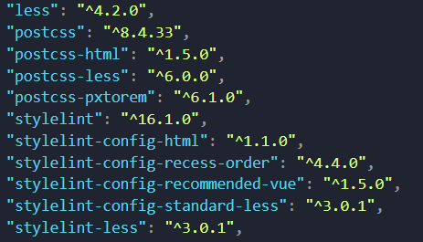

# ChainTest

> Vue3项目工具链测试，工具链旨在方便开发，团队之间的协作更流畅。

&nbsp;&nbsp;首先要确定的是各个插件工具的分工是什么？

## [EsLint](https://zh-hans.eslint.org/docs/latest/use/core-concepts)

`EsLint`是一个可配置的`JavaScript`检查器。它可以帮助你发现并修复`JavaScript`代码中的问题。问题可以指潜在的运行时漏洞、未使用的最佳实践、风格问题等。

规则是`EsLint`的核心构建块。规则会验证你的代码是否符合预期，以及如果不符合预期怎么做。规则还可以包含针对该规则的额外配置项。

## [StyleLint](https://www.stylelint.cn/)

`StyleLint`是一个强大、先进的CSS代码检测器，可以帮助你规避`CSS`中的错误并保持一致的编码风格。

这个插件库界限就比较分明，顾名思义便是专门管理样式格式的库。

## [prettier](https://www.prettier.cn/)

`Prettier`是一款代码格式化工具，支持大量编程语言，在大多数`IDE`中都有集成。

---

在以往的项目中，时不时会遇到各种各样的工具链问题👇

1. 代码格式化完全失效
2. 样式代码按要求格式化，`script`代码和`template`代码格式化失效
3. 代码突然报红
4. ......

问题多种多样，且很容易出现兼容性问题，十分麻烦，故出现此项目，希望能整理一下各个插件和库之间的关系，方便理顺脉络，出现问题后能及时定位，尽快解决。

在整理出以上几个插件库的介绍后会发现，`eslint`和`prettier`都能进行代码格式化（排除stylellint是因为它比较专），所以平时遇到的很多工具链问题有不少是因为这俩插件库冲突而导致的。

## 版本记录👇

stylelint 16

## 感悟总结💡

### 2.19

加入了`less`库、`stylelint`库。

按正常思考逻辑，先写好配置文件，再看看有哪些需要的包。

**思考❓**

&emsp;&emsp;加入了库，写好配置文件，`IDE`中安装好插件就可以有效果了吗？答案是否定的，并不会这么简单，在以往的实践中，可以看到`package.json`文件中还记录到有其他相关的包，譬如一个项目css库选择`less`，在实际搭建工具链的时候，你就需要找到`stylelint`中配置`less`相关的包，并使用对应的配置项。

<div align=center></div>

&emsp;&emsp;可见，找出对应配置项已有难度，更别说有对应包了，且很容易有版本问题（先前项目中就遇到过，一个有正常工具链的项目突然有一天报错的问题，可能是某个同事更新过某个工具包），尽管相应的包起名有迹可循，但当某个项目需要从0到1开始构建时，所耗费的时间成本是比较高的。

### 2.20

主要熟悉了`stylelint`中的一些规则使用，理解`plugins`的出处和用法。

在引用插件之后你还可以在配置文件中自定义该插件中的配置，具体见 ➡ [plugins](https://www.stylelint.cn/user-guide/configure#plugins)

[一些stylelint插件](https://www.stylelint.cn/awesome-stylelint#plugins)

### 2.21

`stylelint`工具链配置基本完成

本次配置可以知悉的是，`vscode`的相关插件就是同相关库一起使用的，可以这么理解👇

1. 对代码排序、格式化等操作，都是需要`IDE`来实现的（就是`IDE`是最终完成类似动作的"人"）。

2. 如何使`IDE`去做出这些动作呢？那便是需要相关的插件，通常是需要使用到专用的库去驱动这些插件，譬如`stylelint`插件，便是需要`stylelint`相关的库去驱动。

3. 再就是你的个人行为，按照你或团队的代码风格，进行自定义配置，譬如[stylelint的配置文件](https://www.stylelint.cn/user-guide/configure)。

4. 与此同时，你还需要对这些`IDE`插件进行配置，就类似`IDE`中的一些常规配置，对插件也是如此（`.vscode`中的`setting.json`，这个文件就是针对`vscode`的配置）。

```json
// setting.json
// 本质其实就是修改stylelint插件中validate字段的值，哪些文件需要验证
// 你可以看到你对vscode（包括插件）的一些特殊配置修改后会在这份文件中反映，HBuilder中的配置也是类似，可以在图形化界面配置，也可以在专门管理配置的一份json文件配置
{
  "stylelint.validate": ["css", "less", "postcss", "scss", "sass", "vue"]
}
```
